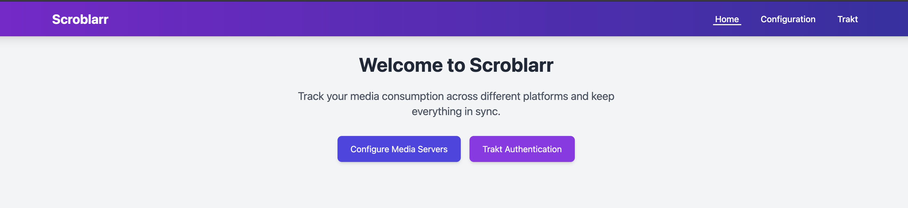

### Scroblarr 



Scroblarr is a self-hosted, open-source multi-directional scrobbling server that allows you to sync your media playback history across various platforms. It supports multiple media players and services, including Plex, Jellyfin, Emby, and more. Scroblarr is designed to be lightweight and easy to set up, making it a great choice for anyone looking to keep their media playback history in sync.

### Features
- **Multi-Platform Support**: Scroblarr supports a wide range of media players and services, including Plex, Jellyfin, Emby.
- **Multi-directional Scrobbling**: Sync your media playback history in multiple directions, allowing you to keep your media library up to date across all platforms.
- **Lightweight and Fast**: Scroblarr is designed to be lightweight and fast, ensuring that it won't slow down your media playback experience.
- **Easy to Set Up**: Scroblarr is easy to set up and configure, making it accessible for users of all skill levels.


### Installation

#### Docker Compose
```yaml
services:
  scroblarr:
    image: ghcr.io/scroblarr/scroblarr:latest
    container_name: scroblarr
    restart: unless-stopped
    ports:
      - "8080:8080"
    volumes:
      - ./scroblarr:/app
    environment:
      - PUID=1000
      - PGID=1000
```

#### Docker CLI
```bash
docker run -d \
  --name scroblarr \
  -p 8080:8080 \
  -v ./config:/app \
  -e PUID=1000 \
  -e PGID=1000 \
  ghcr.io/scroblarr/scroblarr:latest
```

#### Binary

Download the binary from the relase page and run it:

```bash
chmod +x scroblarr
./scroblarr --config /path/to/config
```

### Configuration

Scroblarr can be configured through the web interface or by editing the config.yaml file directly. The config.yaml file is located in the config directory specified during installation.

#### Sample config.yaml
```yaml
servers:
  emby:
    type: emby
    url: http://emby:8096
    token: e071aaa033f0476588751372480ef88b
  embyServer2:
    type: emby
    url: http://emby_url_2:8096
    token: emby_token
  jellyfin:
    type: jellyfin
    url: http://jellyfin:8096
    token: jellyfin_token
  plex:
    type: plex
    url: http://plex:32400
    token: plex_token
    username: plex_username # Optional, if you want to use a specific username

sync:
  - name: plex_sync
    source: plex
    targets:
      - trakt
      - emby
  - name: emby_sync
    source: emby
    targets:
      - jellyfin
  - name: secondary_emby_to_plex_sync
    source: embyServer2
    interval: 30s
    targets:
      - plex
      - trakt
trakt:
  client_id: trakt_client_id
  client_secret: trakt_client_secret

interval: 5s
log_level: debug
port: 8080
```


### Usage

Once Scroblarr is installed and configured, you can access the web interface by navigating to `http://your_server_ip:8080` in your web browser.


### Configuration Options
- **servers**: Define the media servers you want to connect to. Each server must have a unique name and specify its type (e.g., emby, jellyfin, plex).
- **sync**: Define the sync jobs. Each job must have a unique name, a source server, and a list of target servers.
- **trakt**: Configure your Trakt API credentials if you want to sync with Trakt.
- **interval**: Set a global interval for syncing in seconds (default is 5 seconds).
- **log_level**: Set the logging level (e.g., debug, info, warn, error).
- **port**: Set the port for the web interface (default is 8080).

#### Server Options
- **type**: The type of media server (e.g., emby, jellyfin, plex).
- **url**: The URL of the media server.
- **token**: The API token for the media server.
- **username**: Optional. The username for the media server (used for Plex if you want to specify a user).
- **password**: Optional. The password for the media server (used for Plex if you want to specify a user).

For Plex, you need to provide the token for authentication. For Emby and Jellyfin, you can use either a user token or a **username and password** combination.

#### Sync Options
- **source**: The server from which to sync data.
- **targets**: A list of servers to which the data should be synced.
- **name**: A unique name for the sync job.
- **interval**: Optional. The interval at which the sync job should run (default is the global interval).


### Contributing

If you'd like to contribute to Scroblarr, please fork the repository and submit a pull request. We welcome contributions of all kinds, including bug fixes, new features, and documentation improvements.

### License
Scroblarr is licensed under the MIT License. See the [LICENSE](LICENCE) file for more information.

### TODO
- [ ] Add support for more media players and services
- [ ] Improve documentation
- [ ] Add more configuration options
- [ ] Implement user authentication
- [ ] Add support for custom scrobbling intervals
- [ ] Improve error handling and logging
- [ ] Add support for custom scrobbling rules(library, genre, etc.)
- [ ] Implement a web-based dashboard for monitoring scrobbling activity